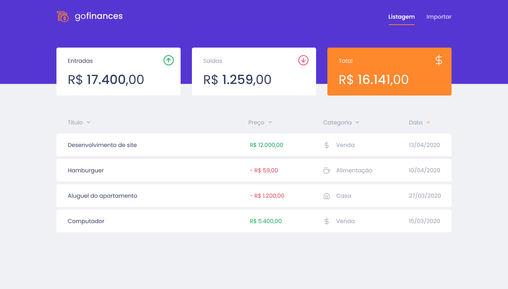
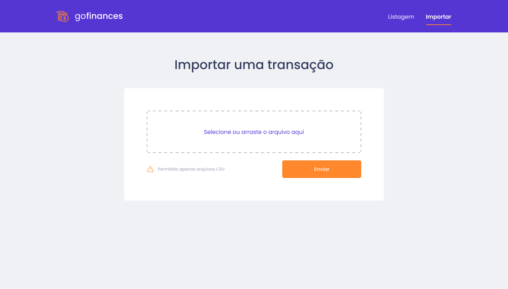

<h1 align="center">
       
</h1>

<p align="center">	
 <a href="https://github.com/daviseares/nlw-01/commits/master">
    
  </a>

   
</p>

 
<hr>


## 🚀 Technologies

This project was developed with the following technologies:

- [Node.js](https://nodejs.org/en/)
- [React](https://reactjs.org)
- [TypeScript](https://www.typescriptlang.org/)

## 💻 Projeto

Control your finances in a practical way with GoFinances.
<p align="center">
 
 
</p>

## :information_source: How To Use

You need install docker and postgree sql before you proceed with backend.
- [Docker](https://www.docker.com/)
- [Postgre SQL](https://hub.docker.com/_/postgres) 
- For more information access [video tutorial](https://www.youtube.com/watch?v=aHbE3pTyG-Q).

After installation, create a new database called "gofinances" and change it in the `ormconfig.js` file .
```bash 
{
 ...
  "database": "gofinances", // change database name
 ...
}

```

### Install Backend 

```bash
# Clone this repository
$ git clone https://github.com/daviseares/gofinances.git

# Go into the repository
$ cd gofinances/backend

# Install dependencies
$ yarn typeorm migration:run

# Start server
$ yarn dev:server

# running on port 3333
```

### Install Web

```bash
# Clone this repository
$ git clone https://github.com/daviseares/gofinances.git

# Go into the repository
$ cd gofinances/web

# Install dependencies
$ yarn

# Run
$ yarn start

# running on port 3000
```


## :memo: Licença

Esse projeto está sob a licença MIT. Veja o arquivo [LICENSE](LICENSE.md) para mais detalhes.
